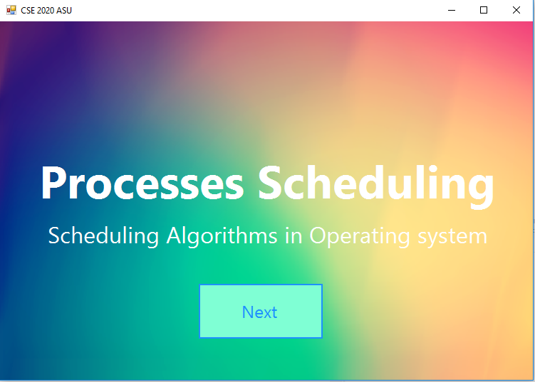
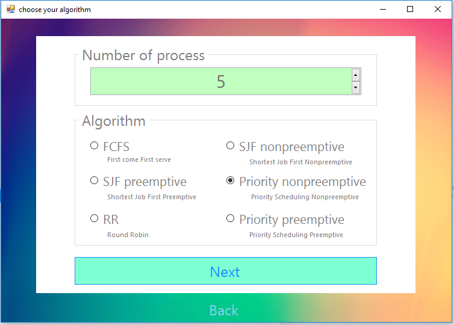
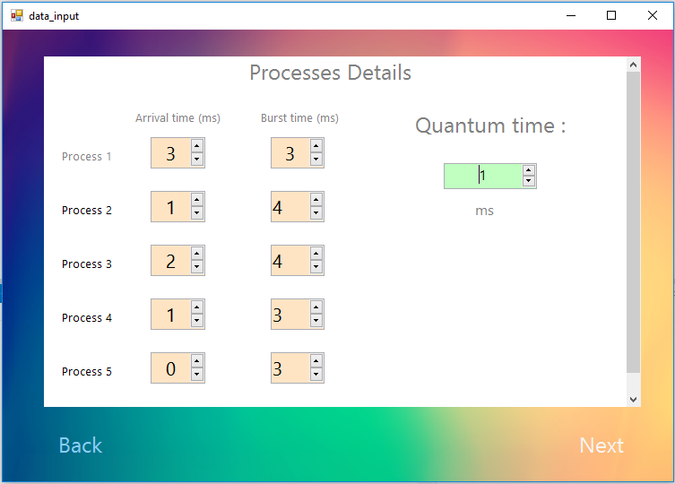
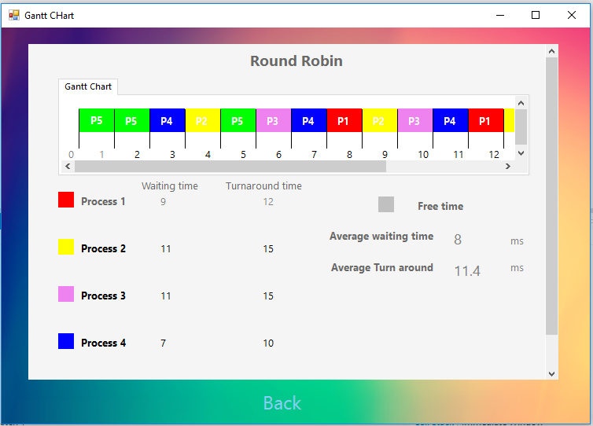

# CPU-Scheduler

Windows Application for simulate graph processes Scheduling in Operating System

Support any number of prosesses in simmulate.and Support 6 Algorithm:

<table>

<tr><td>First come first served (FCFS)</tr></td> 
<tr><td>Shortest Job First Preemptive (SJF - pre)</tr></td> 
<tr><td>Shortest Job First Nonpreemptive (SJF - nonpre)</tr></td>
<tr><td>Priority Preemptive</tr></td>
<tr><td>Priority Nonpreemptive</tr></td> 
<tr><td>Round Robin</tr></td>
</table>

# HOW TO RUN

## first you enter your program with this page 

## then here you choose number of processes and the algorithm used 

## here you can put the data of each process 

## then you get the output of the schedular and the gantt chart here

#implementation 
the code divided to:
1-front end:
the entery form then the form for choose your algorithm then for each group of algorithms you enter another form for data input that is because sometimes we need priority and sometimes quantum time then the result form
2-back end:
each algorithm has his own class that can be called and return the data 
